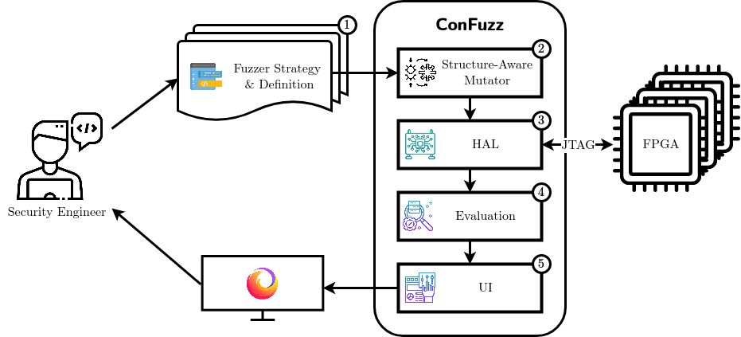

# ConFuzz FPGA Configuration Engine Fuzzing Framework
ConFuzz is an advanced FPGA configuration engine fuzzing and rapid prototyping framework based on [boofuzz](https://github.com/jtpereyda/boofuzz) and [OpenOCD](https://openocd.org/).

The [/JustSTART_paper](./JustSTART_paper) folder contains the complete results related to our [paper](./JustSTART_paper/pdf/JustSTART.pdf) about ConFuzz and the JustSTART attack (CVE-2023-20570).
Further details about reproducing the results are in that folder's [README.md](./JustSTART_paper/README.md).


## Tested with

### Hardware
Xilinx 7-Series:  
https://www.xilinx.com/products/boards-and-kits/1-54wqge.html (basys3)

Xilinx UltraScale:  
https://www.xilinx.com/products/boards-and-kits/kcu105.html (kcu105)

Xilinx UltraScale+:  
https://www.xilinx.com/products/boards-and-kits/ek-u1-kcu116-g.html (kcu116)  
https://opalkelly.com/products/xem8320/ (xem8320)

### Software
[Python 3.12.1](https://www.python.org/downloads/release/python-3121/)  
[OpenOCD 0.12.0](https://sourceforge.net/projects/openocd/files/openocd/0.12.0/)


## Getting started

### Installation
Install Python and OpenOCD, clone this repository and execute the following commands in the ConFuzz directory.

```bash
# Initialize our boofuzz fork as a submodule.
git submodule update --init

# Create and activate a virtual environment.
python -m venv env
. env/bin/activate

# Install boofuzz.
pip install -U pip setuptools
pip install ./boofuzz

# Install framework requirements.
pip install -r requirements.txt
```

### Quickstart
Assuming the respective board is connected to the host, a fuzzer can be started by calling the [main_fuzzer.py](./main_fuzzer.py) with the `--board` and `--fuzzer-name` arguments.

```bash
python main_fuzzer.py -b BOARD -fn FUZZER_NAME
```

All fuzzers are found in the [/fuzzers](./fuzzers/) directory, distinguished and named by their function name, which is always prefixed with `fuzz_`.
For example, the [playground fuzzer](./fuzzers/basys3/playground.py#L11) can be a good starting point to explore:

```bash
python main_fuzzer.py -b basys3 -fn playground
```


## Usage & Documentation


The idea behind ConFuzz is the following: The user selects a fuzzing strategy and a target FPGA to implement a concrete fuzzer ❶.
The implemented fuzzer uses a structure-aware mutator ❷ to generate modified test bitstreams automatically (see [/fuzzers](./fuzzers/) folder).
Then, each modified bitstream is handled by the hardware abstraction layer ❸ in order to program the FPGA and obtain information of the hardware state after configuration ([/src/connections.py](./src/connections.py) & [/src/monitors.py](./src/monitors.py)).
Finally, the state is post-processed in an evaluator ❹, i.e., analyzed for crashes or deviated behavior (also in [/src/monitors.py](./src/monitors.py)), and optionally displayed in a user interface ❺ for manual inspection (the link to the [boofuzz](https://github.com/jtpereyda/boofuzz) web interface is shown after execution).

Section 3 of our [paper](./JustSTART_paper/pdf/JustSTART.pdf) describes this in depth, including several key challenges for FPGA configuration engine fuzzing and the system architecture, workflow, and fundamental components of ConFuzz. 
Further, Section 5 gives three examples of how to use the framework in different ways.
These sections give a good introduction to working with ConFuzz.

The [boofuzz documentation](https://boofuzz.readthedocs.io/en/stable/) helps understanding the underlying boofuzz framework.
Additionally, our source code contains detailed comments and function descriptions explaining all fuzzers and ConFuzz functionality.

We reference official Xilinx documentation at certain points in our source code because knowledge of the FPGA architecture and configuration process is relevant to utilize the full potential of Confuzz.  
References in the comments to [UG470](https://docs.xilinx.com/v/u/en-US/ug470_7Series_Config) refer to v1.16 (February 1, 2023).  
References in the comments to [UG570](https://docs.xilinx.com/r/en-US/ug570_7Series_Config) refer to v1.17 (April 20, 2023).

### Project structure
In the following, we briefly describe the high-level project structure.

#### [/bitstreams](./bitstreams/) folder
This folder contains `.bit` files for each board.
For example, original bitstreams generated with Vivado or bitsteams generated with the [generate_bitstreams.py](./generate_bitstream.py) script.
These bitstreams can be used as seed for certain fuzzers (cf. `FuzzedBitstream` primitive in [/src/primitives.py](./src/primitives.py#L297)).
A `README.md` in the respective folders contains more details about the included example bitstreams.

#### [/fuzzers](./fuzzers/) folder
This folder contains the fuzzer implementations that can be loaded with the [main_fuzzer.py](./main_fuzzer.py) (cf. [Quickstart](#quickstart)).

#### [/register_settings](./register_settings/) folder
This folder contains configuration scripts containing the default crash settings (also called register settings) applied to each register.
Custom register settings `.ini` files can be placed in this folder and loaded with the `--register-settings` command line argument.
Note that this custom `.ini` file can overwrite the default crash settings while itself can be overwritten by register settings directly defined as a function argument in the fuzzer.

#### [/src](./src/) folder
This folder is the core of the framework.
- [callbacks.py](./src/callbacks.py) contains custom functions that can be hooked into the fuzzing process at certain points using the `*_callbacks` arguments of the [boofuzz Session object](https://boofuzz.readthedocs.io/en/stable/source/Session.html).
- [connections.py](./src/connections.py) implements the connection with the target device (via [OpenOCD](https://openocd.org/)).
- [constants.py](./src/constants.py) contains configuration values that are unlikely to change to be used across ConFuzz. Some of these values are board-dependent. Within this file, the configuration options are documented as comments.
- [helpers.py](./src/helpers.py) contains helper functions for various parts of the framework.
- [models.py](./src/models.py) contains all data classes defined for ConFuzz.
- [monitors.py](./src/monitors.py) uses the established connection to the target from [/src/connections.py](./src/connections.py) to manage the target device. For example, the state of the FPGA is probed and checked for crashes.
- [primitives.py](./src/primitives.py) contains bitstream building blocks to construct the bitstreams sent to the FPGA while fuzzing.

#### [/static](./static/) folder
This folder contains static files like test keys and [OpenOCD](https://openocd.org/) configuration files.

### Executables
While the [main_fuzzer.py](./main_fuzzer.py) is the most important executable starting the fuzzing process, we implemented several supporting scripts to extend the functionality of ConFuzz.

#### [main_fuzzer.py](./main_fuzzer.py)
This is the main script to start the fuzzing process.
Several command line options can be added.
Use `-h` or `--help` to get an explanation for all of them.

#### [analyze_logs.py](./analyze_logs.py)
This script can be used in combination with the `log_transmitted_if_crashed` crash setting to analyze the log files and search for bits that are identical in all transmitted values that led to a crash.

#### [generate_bitstreams.py](./generate_bitstream.py)
This script generates a `.bit` bitstream file based on the defined bitstream within this script.
To define the bitstream, the bitstream building blocks implemented in [/src/primitives.py](./src/primitives.py) and [boofuzz primitives](https://boofuzz.readthedocs.io/en/stable/user/protocol-definition.html#primitives) can be used.

#### [cluster_fuzzer.py](./cluster_fuzzer.py)
This script splits up the test cases of a fuzzer over multiple boards.
We used this script to execute the test cases for our basys3 fuzzers on 15 boards in parallel.
However, minor modifications in this script are necessary depending on the hardware used (e.g., boards and USB hubs).

#### [cleanup.sh](./cleanup.sh)
This is a small helper script to clean up the code base and keep the dependencies up to date.

### Adding and configuring fuzzers
Section 3, 5, and especially Section 5.3 of our [paper](./JustSTART_paper/pdf/JustSTART.pdf), are a helpful introduction to the fuzzing process based on ConFuzz.
In the following, we explain the implementation and configuration of a new fuzzer.
Note that besides our [paper](./JustSTART_paper/pdf/JustSTART.pdf), our [fuzzer implementations](./fuzzers/) and comprehensively documented source code can be reviewed as an addition to this guide.

First, a function starting with `fuzz_` has to be added to the respective fuzzer file in [/fuzzers](./fuzzers/).

```python
def fuzz_example_fuzzer(self, session_kwargs: dict = {}):
```

As arguments `self` and `session_kwargs` are passed.
This function is always called with these arguments from the `MainFuzzer` class in the [main_fuzzer.py](./main_fuzzer.py).
The `session_kwargs` dictionary contains default parameters defined in the `MainFuzzer` class.
Some of these arguments are fixed in the `MainFuzzer`, and others are derived from command line arguments.

There exist four main sections in a fuzzer: the [session](#session), the [crash settings](#crash-settings), a [target](#target), and the [bitstream definition](#bitstream-definition).

#### Session
A session is initialized using a [boofuzz Session object](https://boofuzz.readthedocs.io/en/stable/source/Session.html) we forked and extended for ConFuzz.
By default, only a minimal definition is required:

```python
session = Session(**session_kwargs)
```

However, all arguments from the [boofuzz Session object](https://boofuzz.readthedocs.io/en/stable/source/Session.html) can be passed as arguments or overwritten in the `session_kwargs` for an individual fuzzer.

#### Crash settings
Next, crash settings (also called register settings) can be defined.
The high-level functionality is described in the [paper](./JustSTART_paper/pdf/JustSTART.pdf) and the [default_register_settings.ini](./register_settings/default_register_settings.ini) contains all available register settings and their explanation.
They can be omitted entirely, but usually, it is necessary to define custom register settings for each fuzzer.

#### Target
This is a minimal example of adding a target and optionally defined custom register settings to the previously defined session.

```python
session.add_target(
    self._get_target(
        session._fuzz_data_logger,
        custom_register_settings=custom_register_settings,
    )
)
```

If necessary, additional arguments to configure the target can be looked up in the [main_fuzzer.py](./main_fuzzer.py#L90).
These arguments configure the `OpenOCDConnection` in [/src/connections.py](./src/connections.py) and `OpenOCDMonitor` in [/src/monitors.py](./src/monitors.py).

#### Bitstream definition
The bitstream sent to the target device can be defined using our bitstream building blocks implemented in [/src/primitives.py](./src/primitives.py) and [boofuzz primitives](https://boofuzz.readthedocs.io/en/stable/user/protocol-definition.html).
Please refer to our [implemented fuzzers](./fuzzers/) as examples.

#### Finalization
Finally, the previously defined bitstream must be connected with the session, and the `fuzz` function of [boofuzz](https://github.com/jtpereyda/boofuzz) is called.
`self._test_case_name` is passed as an argument to handle the `--test-case-name` command line argument, which executes only a single test case.

```python
session.connect(bitstream_definition)

session.fuzz(self._test_case_name)
```
Once finished, the fuzzer can be started by passing `example_fuzzer` as `--fuzzer-name` to the [main_fuzzer.py](./main_fuzzer.py).

### Steps to add a new development board
- Add class for the new board to [/src/constants.py](./src/constants.py#L138) and add the board to the `AVAILABLE_BOARDS` constant.
- Create board folders in [/bitstreams](./bitstreams/), [/fuzzers](./fuzzers/), [/register_settings](./register_settings/), and [/static](./static/).
- Create an OpenOCD configuration file in the newly created folder in [/static](./static/).
- Create a `default_register_settings.ini` in the newly created folder in [/register_settings](./register_settings/).
- Create a fuzzer (e.g., playground) and an `__init__.py` in the newly created folder in [/fuzzers](./fuzzers/).
- Import the correct fuzzers based on `CONSTANTS.BOARD` in the [main_fuzzer.py](./main_fuzzer.py#L37).
- Optionally add test keys to the newly created folder in [/static](./static/) and an example bitstream to the newly created folder in [/bitstreams](./bitstreams/).
- Add the new board to the README and create a pull request to upstream your work. :)


## License
This repository is distributed under the MIT License. See [LICENCE](./LICENCE) for more information.


## Contact
Please feel free to contact us using GitHub's [discussions](https://github.com/emsec/ConFuzz/discussions) feature.


## BibTeX
To cite this work, please use the reference below:

```bibtex
@article{Ender_Hahn_Fyrbiak_Moradi_Paar_2024,
    title={JustSTART: How to Find an RSA Authentication Bypass on Xilinx UltraScale(+) with Fuzzing},
    volume={2024},
    url={https://tches.iacr.org/index.php/TCHES/article/view/11435},
    DOI={10.46586/tches.v2024.i2.426-450},
    abstractNote={&amp;lt;p&amp;gt;Fuzzing is a well-established technique in the software domain to uncover bugs and vulnerabilities. Yet, applications of fuzzing for security vulnerabilities in hardware systems are scarce, as principal reasons are requirements for design information access, i.e., HDL source code. Moreover, observation of internal hardware state during runtime is typically an ineffective information source, as its documentation is often not publicly available. In addition, such observation during runtime is also inefficient due to bandwidth-limited analysis interfaces, i.e., JTAG, and minimal introspection of hardware-internal modules.&amp;lt;br&amp;gt;In this work, we investigate fuzzing for Xilinx 7-Series and UltraScale(+) FPGA configuration engines, the control plane governing the (secure) bitstream configuration within the FPGA. Our goal is to examine the effectiveness of fuzzing to analyze and document the opaque inner workings of FPGA configuration engines, with a primary emphasis on identifying security vulnerabilities. Using only the publicly available hardware chip and dispersed documentation, we first design and implement ConFuzz, an advanced FPGA configuration engine fuzzing and rapid prototyping framework. Based on our detailed understanding of the bitstream file format, we then systematically define 3 novel key fuzzing strategies for Xilinx FPGA configuration engines. Moreover, our strategies are executed through mutational structure-aware fuzzers and incorporate various novel custom-tailored, FPGA-specific optimizations to reduce search space. Our evaluation reveals previously undocumented behavior within the configuration engine, including critical findings such as system crashes leading to unresponsive states of the whole FPGA. In addition, our investigations not only lead to the rediscovery of the recent starbleed attack but also uncover a novel unpatchable vulnerability, denoted as JustSTART (CVE-2023-20570), capable of circumventing RSA authentication for Xilinx UltraScale(+). Note that we also discuss effective countermeasures by secure FPGA settings to prevent aforementioned attacks.&amp;lt;/p&amp;gt;},
    number={2},
    journal={IACR Transactions on Cryptographic Hardware and Embedded Systems},
    author={Ender, Maik and Hahn, Felix and Fyrbiak, Marc and Moradi, Amir and Paar, Christof},
    year={2024},
    month={Mar.},
    pages={426–450}
}
```
